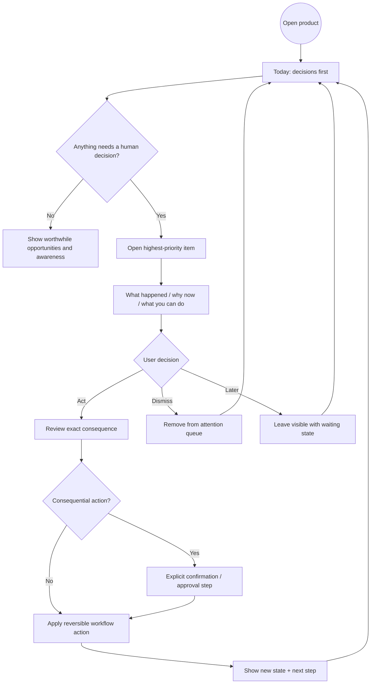
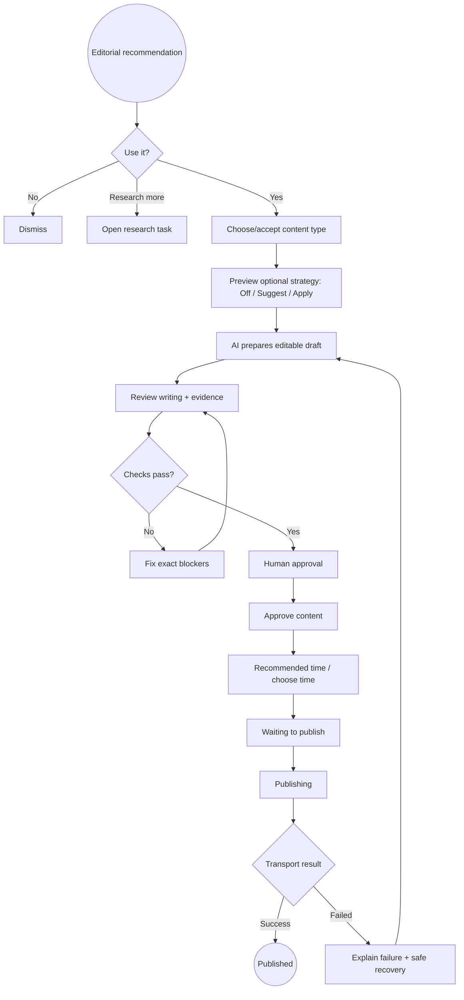
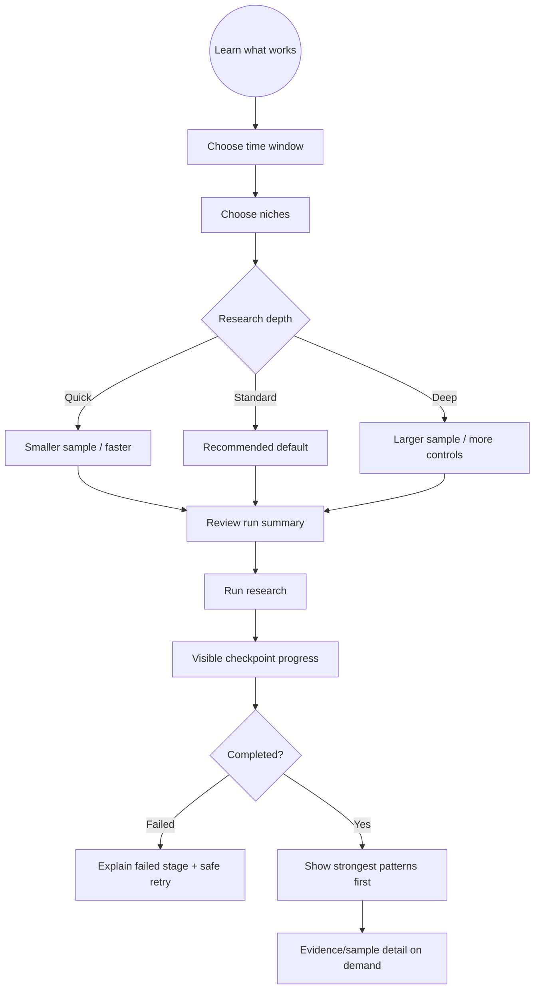
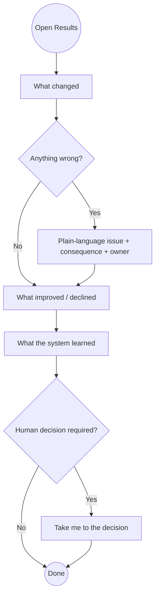
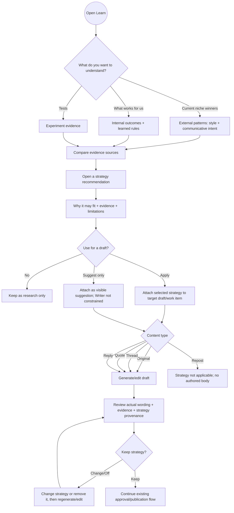

# Human-Centered UX/HCI Deep Research and Redesign Program

**Goal:** Redesign the current X Network Growth OS around one explicit business purpose: acquire relevant attention and niche followers efficiently, convert that audience into durable opportunities/revenue/build visibility, and make the system's learned growth strategy understandable and optionally usable without requiring ordinary operators to understand the underlying AI, research, workflow, or experiment architecture.

**Architecture:** Keep the existing React/Vite product and backend authority boundaries. Redesign information architecture, language, task flows, recommendation surfaces, status/recovery patterns, and progressive disclosure around user goals. Research and prototype before changing major navigation or workflow semantics; use the current implementation as the baseline rather than the older server-rendered UX plan.

**Tech Stack:** React, TypeScript, Vite, TanStack Query, Tailwind CSS, Node.js HTTP/API layer, SQLite-backed domain state, Mermaid for flow artifacts.

## Global Constraints

- Primary operators and stakeholders are not developers, professional traders, or experts in the system's internal scoring vocabulary.
- Preserve all existing approval, scheduling, publication, send, Account Health, experiment, and learned-strategy authority boundaries.
- Do not require users to understand TargetScore, EngagePriority, Phase numbers, AI runtime profiles, model names, confidence machinery, database state, or algorithm-internal terminology to complete common tasks.
- Keep technical diagnostics and exact provenance available for advanced inspection, but never as the default decision surface.
- Every consequential action must make its effect predictable before activation and give clear feedback afterward.
- Prefer recognition over recall: relevant evidence, context, current state, and next steps should be visible where decisions happen.
- Use plain language and stable labels consistently across the product.
- Default designs must work on phone-sized screens as well as desktop.
- Accessibility target for implementation is WCAG 2.2 AA where applicable.
- User research findings outrank stakeholder preference when they reveal task or comprehension failures.
- Do not invent conversion targets before a baseline exists.
- Relevant-audience growth is the default optimization target; raw impressions, likes, or follower count alone are not the north star.
- External Viral Styles findings and internal account learnings must remain separate evidence sources. Do not blend them into an opaque score or present correlation as causation.
- Viral research may infer **communicative intent expressed by the post** (for example teach, demonstrate, compare, announce, challenge, curate). It must not claim to know an author's private motivation.
- Learned writing guidance is optional at draft time. The operator must be able to choose `Off`, `Suggest`, or `Apply`; default to `Suggest` until user research demonstrates a better default.
- Applying learned guidance may shape presentation strategy only. It must not override remaining hard gates, selected content type, human approval, publication timing, or send/publication authority.
- External viral-pattern evidence must never silently become an accepted production learned rule. Existing learned-rule acceptance remains an explicit human action backed by qualified internal/experiment evidence.
- A business goal such as revenue or opportunities may be shown as a strategic purpose only when the product distinguishes what is directly measured from what is merely a longer-term outcome. Do not pretend to optimize revenue if no revenue/conversion observation exists.

---

# 1. Research Thesis

The product is no longer mainly suffering from missing capability. It now has too much capability exposed too directly.

The UX problem is therefore:

> The system is organized around what the software knows and can do, while ordinary users think in terms of decisions, outcomes, and consequences.

The redesign should optimize five questions:

1. What needs my attention?
2. What should I do next?
3. Why is this being recommended?
4. What will happen if I click this?
5. Is this working?

Target interaction model:

**answer first -> action second -> explanation on demand -> technical detail on demand**

---

# 1A. Strategic Product Purpose

The product should make its growth purpose explicit rather than forcing users to infer it from disconnected analytics and automation modules.

North-star product statement:

> **Find relevant attention -> decide where to participate -> create differentiated content -> publish under human control -> measure audience/opportunity outcomes -> learn what works -> reuse that learning deliberately.**

The product is not optimizing for virality as an end in itself. It is trying to build **audience capital** in a defined niche: relevant followers, reputation, relationships, launch distribution, product interest, inbound opportunities, and eventually revenue.

## Strategic goals visible to the operator

The UX should let the operator state the purpose of a piece of work in plain language while preserving the existing deterministic editorial objective model underneath.

| User-facing goal | Current system mapping | Product interpretation |
|---|---|---|
| Grow relevant followers | `qualified_growth` | Default. Optimize **qualified growth velocity**: relevant follower/audience-quality movement per unit time, while preserving attribution caveats and avoiding vanity reach. |
| Maximize reach | `reach_momentum` | Prefer distribution/momentum when it passes the remaining quality gates. |
| Build technical authority | `technical_authority` | Prefer credible technical insight, evidence, and durable reference value. |
| Build relationships / opportunities | `relationships` | Prefer conversation and relationship potential; later connect to explicit opportunity outcomes when those exist. |
| Showcase a build | initially `balanced` + explicit desired reader outcome | Optimize for qualified attention to a concrete product/build; do not claim conversion optimization without observed conversion data. |
| Run an experiment | existing experiment assignment + relevant editorial objective | Preserve explicit experiment/variant ownership; do not let learning guidance silently assign experiments. |
| Revenue / monetization | strategic outcome only until conversion data exists | Show as a long-term purpose, not a falsely precise scoring objective. |

Do not expand the existing `EDITORIAL_OBJECTIVES` enum merely to create marketing labels. Add a separate strategic-goal presentation layer only when a goal needs product-specific context that the existing objective does not represent.

## Success hierarchy

When the system explains whether something is “working,” use this hierarchy:

1. **Business outcomes when actually observed** — leads, product signups, paid conversion, partnership/inbound opportunity.
2. **Relevant audience growth** — newly observed relevant followers and follower-quality changes, with attribution caveats.
3. **Relationship outcomes** — continued conversations, recurring relationships, mutual/relevant connections.
4. **Durable content value** — bookmarks/saves, qualified replies, profile interest when observable.
5. **Distribution** — views/reach/reposts.
6. **Vanity interaction** — raw likes alone.

This hierarchy is a product interpretation rule, not a claim about X's hidden ranking weights.

---

# 1B. Learning Architecture: External + Internal + Human Choice

`Learn` should become the strategy brain of the product, but it must preserve provenance instead of collapsing every signal into one synthetic “AI knows best” model.

## External evidence — what is currently working in the niche

Owner: existing Viral Styles research stack:

- `viral_style_research.js`
- `viral_style_sweep.js`
- `viral_style_intent.js`
- `viral_style_analyze.js`
- `viral_style.js`

External evidence can describe:

- presentation style / hook family;
- communicative intent expressed in the post;
- format and thread anatomy;
- niche/topic;
- account-size/post-age cohorts;
- follower-normalized reach and interaction densities;
- same-author / comparable-author lift where available;
- evidence class, sample size, interval, and observational limitations.

It answers:

> **What presentation strategies appear to be outperforming among comparable niche posts right now?**

It does **not** answer:

> “What causes X to rank a post?” or “What was this author's private motivation?”

## Internal evidence — what works for this account

Owners already exist in:

- Phase-4 publication measurements and experiment cohorts in `store.js` / experiment domain;
- editorial outcome provenance and summaries;
- `learning.js` suggested/accepted/retired rules;
- relationship outcomes and audience-quality observations.

It answers:

> **What has repeatedly produced useful outcomes for this account?**

## Strategy synthesis — what might fit this specific draft opportunity

Introduce one synthesis layer that reads external and internal evidence without becoming a second learned-rule authority.

Proposed interface:

```ts
type WritingStrategyMode = 'off' | 'suggest' | 'apply'

interface WritingStrategyGuidance {
  objective: string
  pipeline: 'original' | 'quote' | 'thread' | 'reply' | 'repost'
  mode: WritingStrategyMode
  recommendedIntent: string | null
  recommendedStyle: string | null
  rationale: string[]
  applicability: 'strong_fit' | 'possible_fit' | 'weak_fit' | 'not_applicable'
  externalEvidence: StrategyEvidenceRef[]
  internalEvidence: StrategyEvidenceRef[]
  experimentContext: StrategyEvidenceRef[]
  limitations: string[]
}
```

The synthesis must expose each evidence source separately. No hidden weighted blend is required for the first implementation.

## Communicative intent taxonomy

Keep intent distinct from style and reuse the already-landed `viral_style_intent.js` taxonomy rather than inventing a second classifier. The current bounded intent labels are:

- `announce_release`;
- `report_experiment`;
- `compare_evaluate`;
- `teach_explain`;
- `share_resource`;
- `solve_problem`;
- `save_cost_time`;
- `ask_community`;
- `provoke_opinion`;
- `create_urgency`;
- `promote_offer`;
- `recruit_career`;
- `build_in_public`;
- `share_news_update`;
- `share_observation`.

Semantic presentation style remains the separate existing bounded taxonomy (`announcement`, `field_note`, `benchmark_breakdown`, `comparison`, `how_to`, `curated_list`, `resource_drop`, `problem_solution`, `news_update`, `opinion`, `community_question`, `offer`, `career_post`, `build_in_public`, `short_observation`).

The UX may translate these to plain labels such as “Teach/explain” or “Report an experiment,” but persisted/provenance data should retain the canonical IDs.

## Optional application contract

- **Off** — do not include learned style/intent guidance in the Writer packet.
- **Suggest** — show the recommendation and evidence to the operator; Writer remains unchanged until the operator selects a strategy. This is the default hypothesis.
- **Apply** — include the explicitly selected strategy in the Writer packet and ask the Writer to use it only when compatible with evidence, content type, voice, and hard constraints.

For `repost`, writing strategy is normally `not_applicable` because there is no authored post body.

For `quote`, `reply`, `original`, and `thread`, the same learned pattern may require different realization. The system should recommend **strategy**, not a copyable template.

---

# 2. Research Roles

These are behavioral roles, not elaborate personas.

## Daily Operator

Needs to:
- see what deserves attention;
- continue useful conversations;
- review AI-prepared work;
- approve/schedule/publish safely;
- understand why something is blocked;
- dismiss poor recommendations quickly.

Does not need to know:
- scorer formulas;
- database state;
- AI provider/runtime implementation;
- experiment internals.

## Owner / Stakeholder

Needs to answer, within a few minutes:
- What happened?
- Is it working?
- Is anything wrong?
- What are we learning?
- What needs a human decision?

They should not need to operate the system to understand it.

## Occasional Reviewer

Uses the system less frequently and therefore cannot be expected to remember state semantics, labels, or workflows between sessions.

This role is especially important for cognitive walkthroughs because it exposes recall-heavy design.

## Advanced Operator

Needs exact metrics, evidence, AI provenance, runtime configuration, experiment setup, health diagnostics, and overrides.

Advanced access should exist, but should not determine the default IA for everyone else.

---

# 3. Current-State Product Diagnosis

Current React primary navigation:

- Today
- Discover
- Viral Styles
- Conversations
- Posts
- Performance
- Experiments
- Diagnostics

This is an improvement over the older module-heavy dashboard, but it still mixes three different concepts in the same navigation level:

1. **goals** — Today, Discover, Conversations;
2. **work objects** — Posts;
3. **analysis/system methods** — Viral Styles, Performance, Experiments, Diagnostics.

That increases the amount of product architecture users must learn.

## Strong current patterns to preserve

- Today already starts from attention and decisions rather than raw modules.
- Recommendation explanation and Technical Details use progressive disclosure.
- Approval gates distinguish writing checks from human confirmations.
- Pending/error/empty primitives provide a reusable state vocabulary.
- AI Editorial Plan distinguishes recommendation from selection and approval.
- Viral Styles now exposes named background checkpoints rather than appearing frozen.

## Primary current UX risks

### A. Primary navigation is still method-oriented

`Viral Styles`, `Experiments`, and `Diagnostics` are methods or internal functions, not obvious user goals.

Research question:
> Where do users expect to go to answer “what is working?” and “what should we change?”

Do not rename these by taste; validate through card sorting and tree testing.

### B. Viral Styles exposes research machinery before user intent

The current research form asks ordinary users about:
- discovery floors;
- maximum posts per query;
- same-author controls;
- AI profile vs runtime;
- exact model;
- reasoning/effort.

Those are valid expert controls, but the default user goal is closer to:

> “Study what writing styles performed unusually well in my niches over the last 2–4 weeks.”

The default surface should therefore use a research-depth abstraction and configured AI default. Exact model/runtime should move under Advanced setup.

### C. Some product language remains analytical rather than decision-oriented

Examples:
- `90% association intervals`
- `AI intent labeled`
- `Comparable to author`
- `Discovery floor`
- `Experiments`
- `Diagnostics`

These are useful concepts but not necessarily good first-layer language for non-experts.

### D. Status is present but distributed

Users may need to remember whether an item is:
- recommended;
- selected;
- draft;
- needs review;
- approved;
- waiting;
- publishing;
- published;
- failed;
- researching.

The redesign should present these as a visible lifecycle rather than relying on vocabulary memory.

### E. Generic errors lack action-specific recovery

The shared Error primitive correctly says something went wrong and supports retry, but product-level failures should explain:
- what failed;
- whether anything changed;
- what the user should do now;
- whether retry is safe.

---

# 4. Information Architecture Hypotheses

Do not treat either option as final until tree testing.

## Variant A — Five primary destinations

- **Today** — what needs attention now
- **Discover** — what is worth talking about
- **Conversations** — who to respond to
- **Posts** — what is being prepared/published
- **Results** — what happened and what is working

Secondary under Results / More:
- What works / Viral research
- Audience
- Tests / Learnings
- Settings
- Diagnostics

## Variant B — Six primary destinations

- Today
- Discover
- Conversations
- Posts
- Results
- Learn

Under Learn:
- **Current winning styles** — external Viral Styles evidence from the selected recent window;
- **What works for you** — internal measured account outcomes and accepted/suggested learned rules;
- **Tests** — explicit experiments and variants;
- **Strategy recommendations** — evidence-backed, optional writing/format guidance that can be previewed before use.

Under Settings / Advanced:
- AI Settings
- Diagnostics
- raw health/evidence/runtime detail

## Research hypothesis

Variant B is currently the stronger hypothesis because “Learn” is a user goal while “Viral Styles” and “Experiments” are mechanisms. It also gives the product one understandable place to answer both “what is winning in the niche?” and “what works for me?”, while keeping evidence provenance visible and diagnostics out of the daily path.

---

# 5. Task Analysis

Prioritize by frequency × consequence × confusion risk.

| Task | Primary role | Frequency | Consequence | Research priority |
|---|---|---:|---:|---:|
| See what needs attention | Operator | very high | medium | P0 |
| Decide whether to act on an editorial recommendation | Operator | high | high | P0 |
| Review/edit/approve a post | Operator | high | very high | P0 |
| Continue a conversation | Operator | high | high | P0 |
| Understand why something is blocked | Operator | medium | very high | P0 |
| Review/override optional writing-strategy guidance before generation | Operator | high | medium | P0 |
| Run viral-style research | Operator | occasional | low | P1 |
| Understand recent performance | Operator/Stakeholder | medium | medium | P1 |
| Understand account/audience status | Stakeholder | medium | medium | P1 |
| Decide whether a pattern is credible | Operator/Stakeholder | occasional | medium | P1 |
| Compare external winning patterns vs what works for this account | Operator/Stakeholder | occasional | medium | P1 |
| Choose whether to apply a learned style/intent to a draft | Operator | high | medium | P1 |
| Create/assign an experiment | Advanced operator | low | medium | P2 |
| Configure AI runtime/model | Advanced operator | rare | high | P2 |
| Inspect diagnostics | Advanced operator | rare | medium | P3 |

---

# 6. Core Task Flows

## Flow A — Daily orientation to action



Risk points to observe:
- user cannot distinguish recommendation from approval;
- unclear primary action;
- state after action is ambiguous;
- user expects immediate posting when action only prepares work.

## Flow B — Recommendation to published post



The visible lifecycle should be rendered consistently anywhere this work appears.

## Flow C — Run Viral Styles research

Default path for ordinary users:



Advanced setup can expose exact discovery thresholds, control counts, AI profile/runtime/model, and reasoning effort.

## Flow D — Stakeholder understands performance



## Flow E — Learn -> optional strategy -> draft



Required UX properties:

- external and internal evidence are visually distinguishable;
- the operator can see whether guidance is `Off`, `Suggest`, or `Apply` before generation;
- `Apply` describes the intended presentation strategy, not fixed wording to copy;
- changing/removing strategy is reversible before approval;
- the draft always shows whether learned guidance actually influenced generation;
- no strategy action approves, schedules, publishes, sends, accepts a learned rule, or assigns an experiment.

---

# 7. Cognitive Walkthrough Protocol

For every step in each P0/P1 task, evaluate four questions:

1. Will the user know what goal they are trying to accomplish here?
2. Will they notice the correct action?
3. Will they understand that the action leads toward their goal?
4. After acting, will they understand what happened and what comes next?

Record failures as observable defects, not design opinions.

Example:

**Observed UI:** `Run research` is preceded by model/runtime configuration.

**Likely novice failure:** user believes selecting a model is necessary to study past successful posts.

**Design repair hypothesis:** ordinary path selects research scope and depth; configured AI default is used automatically; exact runtime/model moves to Advanced setup.

---

# 8. Heuristic Evaluation Framework

Use Nielsen's ten heuristics, with extra weight on these for this product:

1. Visibility of system status
2. Match between system and real-world language
3. User control and freedom
4. Consistency and standards
5. Error prevention
6. Recognition rather than recall
7. Flexibility for expert users without burdening novices
8. Aesthetic/minimalist information density
9. Error recognition, diagnosis, and recovery
10. Contextual help

Severity:

- **P0:** blocks task or risks an unintended consequential action
- **P1:** recurring major misunderstanding/friction
- **P2:** efficiency/readability problem
- **P3:** polish/consistency issue

A visual defect is not P0/P1 unless it causes task, comprehension, recovery, or accessibility failure.

---

# 9. Research Program

## Phase 0 — Baseline evidence

Artifacts:
- `docs/ux/CURRENT_STATE_IA.md`
- `docs/ux/ACTION_INVENTORY.md`
- `docs/ux/BASELINE_HEURISTIC_REVIEW.md`

Work:
- inventory every route, dominant action, destructive/consequential action, status, error, and help path;
- record current terminology;
- record task depth/click count for the P0/P1 jobs;
- capture phone and desktop screenshots for baseline comparison;
- identify existing analytics or add lightweight event logging only if needed later.

Exit:
- no primary screen/action/state is undocumented;
- P0/P1 heuristic findings are tied to a user failure.

## Phase 1 — Contextual task analysis

Participants:
- daily/likely operators;
- owner/stakeholder users;
- occasional/non-expert reviewers.

Method:
- observe real or realistic work before asking feature questions;
- ask users to explain what they are trying to decide;
- record their vocabulary before showing product labels;
- identify information they seek before making a decision;
- identify what they fear doing accidentally.

Deliverables:
- `docs/ux/TASK_ANALYSIS.md`
- `docs/ux/USER_LANGUAGE_LEDGER.md`
- `docs/ux/JOBS_TO_BE_DONE.md`

Exit:
- P0/P1 tasks can be stated without current module names or technical terms.

## Phase 2 — Journey map + service blueprint

Deliverables:
- `docs/ux/JOURNEY_MAPS.md`
- `docs/ux/SERVICE_BLUEPRINT.md`

Map:
- daily operator journey;
- stakeholder review journey;
- delayed/background states: research run, schedule wait, publication, measurement, learned recommendation.

The service blueprint must pair each visible state with the backstage authoritative owner.

Exit:
- recommendation, selection, approval, waiting, publishing, published, failed, and researching cannot be conflated.

## Phase 3 — IA card sorting and tree testing

Test both IA variants using real task prompts rather than asking which nav users “like.”

Example tree-test tasks:
- “You want to know what needs your decision right now. Where do you go?”
- “You want to see which writing styles have repeatedly performed better. Where do you go?”
- “You want to see why a post failed to publish. Where do you go?”
- “You want to understand whether your audience is becoming more relevant. Where do you go?”
- “You need to change which AI model the system uses. Where do you go?”

Deliverable:
- `docs/ux/IA_RESEARCH.md`

Exit:
- navigation labels/placement are based on observed findability, not stakeholder preference.

## Phase 4 — Task flows and wireflows

Create one Mermaid flow per core job.

For each:
- happy path first;
- decisions;
- blocked states;
- errors;
- recovery;
- explicit wait/session boundary;
- success/exit.

Deliverables:
- `docs/ux/TASK_FLOWS.md`
- `docs/ux/USER_FLOWS.md`
- `docs/ux/WIREFLOWS.md`

Exit:
- no orphan branch;
- each consequential action exposes its effect before activation.

## Phase 5 — Content design system

Deliverables:
- `docs/ux/PRODUCT_LANGUAGE.md`
- `docs/ux/STATUS_LANGUAGE.md`
- `docs/ux/HUMAN_AI_INTERACTION.md` — reuse/upgrade the existing repository owner rather than creating a duplicate Human-AI patterns document

Define reusable patterns for:
- recommendation;
- uncertainty;
- evidence;
- AI vs deterministic rule vs human choice;
- approval;
- scheduled/waiting/publishing/published;
- failure/retry;
- blocked state;
- observational vs causal result;
- advanced technical detail.

Exit:
- ordinary workflows contain no unexplained internal jargon.

## Phase 6 — Low-fi prototypes

Prototype at least:
- Today;
- Discover;
- Conversations;
- Posts lifecycle;
- Results;
- Learn / Viral research.

Prototype both desktop and mobile.

Do not polish visual style yet. Validate hierarchy, labels, primary actions, and state transitions first.

## Phase 7 — Expert walkthrough before user sessions

Perform:
- cognitive walkthrough;
- heuristic evaluation;
- WCAG 2.2 AA-oriented review;
- mobile interaction review.

Repair known P0/P1 defects before using participants' time.

Deliverable:
- `docs/ux/PROTOTYPE_REVIEW.md`

## Phase 8 — Moderated usability sessions

Use realistic task scenarios without coaching.

For consequential actions, ask before the click:

> “What do you think will happen if you press this?”

Observe:
- task completion;
- wrong-path navigation;
- backtracking;
- hesitation;
- help requests;
- terminology confusion;
- action prediction;
- recovery from errors;
- mobile interaction problems.

Use small iterative rounds rather than one large final study. Qualitative rounds can start around five representative users per target behavior group, then repeat after major repairs; do not interpret that as statistical validation.

Deliverables:
- `docs/ux/USABILITY_GUIDE.md`
- `docs/ux/USABILITY_FINDINGS.md`

## Phase 9 — User story map

Backbone:

**Orient -> Discover -> Decide -> Converse/Create -> Review -> Act -> Understand result -> Improve**

Stories are organized by user value rather than source file/module.

Deliverable:
- `docs/ux/UX_STORY_MAP.md`

---

# 10. Proposed Implementation Releases

Only start after the research artifacts establish the target IA/language. These releases are intentionally ordered so UX simplification lands before the strategy brain starts influencing generation.

## Release 1 — Validated shell and orientation

**Files:**
- Modify: `ui/src/App.tsx`
- Create: `ui/src/components/AppShell.tsx`
- Modify: `ui/src/components/primitives.tsx`

**Interfaces:**
- Consumes: existing hash routes and feature surfaces.
- Produces: validated primary navigation, mobile navigation, shared page-purpose/status affordances, and an Advanced entry point.

**Implementation:**
- implement the IA variant supported by card-sort/tree-test findings;
- if Variant B wins, expose Today / Discover / Conversations / Posts / Results / Learn as primary destinations;
- retain compatibility aliases for existing `#/viral`, `#/improve`, and `#/advanced` links during rollout;
- keep AI Settings and diagnostics reachable without exposing them as ordinary daily-work choices;
- use one consistent responsive navigation pattern rather than horizontally overflowing primary navigation on phone-sized screens.

**Acceptance criteria:**
- a first-time operator can locate the five P0 tasks without knowing existing module names;
- Advanced/system routes remain available but do not dominate the primary navigation;
- existing deep links continue to resolve during migration.

## Release 2 — Decision cards, lifecycle, and consequence language

**Files:**
- Modify: `ui/src/features/today/Today.tsx`
- Modify: `ui/src/features/create/Create.tsx`
- Modify: `ui/src/features/create/DraftPage.tsx`
- Modify: `ui/src/features/create/DraftEditor.tsx`
- Modify: `ui/src/features/conversations/Conversations.tsx`
- Modify: `ui/src/features/conversations/ConversationDetail.tsx`
- Modify: `ui/src/components/primitives.tsx`

**Interfaces:**
- Consumes: current Today actions, editorial selections, drafts, gates, queue states, conversation actions.
- Produces: reusable decision-card anatomy and visible lifecycle semantics.

**Implementation:**
- standardize decision cards around `What / Why now / What you can do / What happens next`;
- show recommendation, human selection, approval, scheduled/waiting, publishing, published, failed, and researching as explicit lifecycle states;
- state in plain language whether each button prepares, selects, approves, schedules, sends, publishes, dismisses, or retries;
- make recovery copy action-specific: what failed, whether state changed, and whether retry is safe.

**Acceptance criteria:**
- users can predict whether a button sends/publishes immediately before pressing it;
- recommendation, selection, approval, and publication are not visually or verbally conflated.

## Release 3 — Learn center and simplified Viral research

**Files:**
- Create: `ui/src/features/learn/Learn.tsx`
- Modify: `ui/src/features/viral/ViralStyles.tsx`
- Modify: `ui/src/features/improve/Improve.tsx`
- Modify: `ui/src/App.tsx`
- Modify: `ui/src/api/client.ts`

**Interfaces:**
- Consumes: existing Viral Styles report/job APIs, Improve experiments/learned rules, editorial/account outcome reads.
- Produces: one Learn destination with separate external, internal, experiment, and strategy-recommendation views.

**Implementation:**
- default Learn sections: `Current winning styles`, `What works for you`, `Tests`, `Strategy recommendations`;
- preserve provenance labels so external niche evidence can never be mistaken for internal account evidence;
- replace default Viral research controls with time window, niches, Quick/Standard/Deep depth, optional AI analysis, and Run;
- move exact thresholds, max posts/query, controls, thread reconstruction, AI profile/runtime/model/reasoning into Advanced setup;
- lead Viral results with human-readable patterns, intended communicative function, applicability, evidence strength, and examples before statistical detail;
- retain the existing progress checkpoint stream and stop semantics.

**Acceptance criteria:**
- a non-technical user can answer “what style and intent are winning right now?” without configuring runtime/model parameters;
- a user can distinguish `what is winning externally` from `what works for my account`;
- all raw evidence and advanced controls remain inspectable.

## Release 4 — Writing strategy synthesis and durable human selection

**Files:**
- Create: `strategy_guidance.js`
- Modify: `viral_style_intent.js`
- Modify: `store.js`
- Modify: `editorial.js`
- Modify: `web_api.js`
- Modify: `agent_bridge.js`
- Modify: `ui/src/api/client.ts`

**Interfaces:**
- Consumes: structured Viral Styles groups from `analyzeStoredDataset()`, the existing bounded intent/style taxonomy, published-main-feed content, editorial objective/pipeline/candidate context, Phase-4 outcome summaries, experiments, and accepted/suggested learned rules.
- Produces: reusable intent/style classification for internal published content, `WritingStrategyGuidance` options, and append-only human strategy selections.

**Domain interfaces to implement:**

```js
classifyViralStyleTexts(rows, { profile, runtime, model, reasoning, timeoutMs })
buildWritingStrategyGuidance({ objective, pipeline, candidate, editorialRecommendation, externalPatterns, internalOutcomes, learnedRules, experiments })
listWritingStrategyOptions(context)
recordWritingStrategySelection(queueItemId, { mode, intent, style, guidanceSnapshot, actor: 'human' })
getLatestWritingStrategySelectionForQueueItem(queueItemId)
getWritingStrategySelectionInForceAtPublication(queueItemId)
```

**Persistence:**
- add cached `content_style_labels` so the account's own historical posts can use the same canonical intent/style vocabulary as external Viral Styles research without paying repeated AI classification cost;
- `content_style_labels` fields: `id`, `queue_item_id`, `content_hash`, `taxonomy_version`, `primary_intent`, `semantic_style`, `audience_goal`, `reader_action`, `confidence`, `evidence_spans_json`, `ai_execution_json`, `classified_at`; unique on `(queue_item_id, content_hash, taxonomy_version)`;
- changing the published text/content hash invalidates reuse; semantic classification of historical internal posts is operator-triggered/explicit in Learn and must not silently spend AI tokens in the background;
- add append-only `writing_strategy_selections` rather than mutating learned rules or Viral Styles records;
- `writing_strategy_selections` fields: `id`, `queue_item_id`, nullable `draft_id`, `mode`, nullable `intent`, nullable `style`, `guidance_json`, `selected_by`, `selected_at`; the selection in force at publication is the latest row with `selected_at <= published_at`;
- `guidance_json` stores the exact external/internal/experiment evidence references, objective/pipeline/applicability/rationale/limitations, and the recommendation snapshot visible at selection time;
- never store raw external pattern text as an accepted learned adjustment merely because it was selected for writing.

**Synthesis rules:**
- `strategy_guidance.js` is deterministic in the first implementation: it ranks/filters already-classified evidence and does not introduce another provider/model call or opaque learned score;
- external evidence, internal evidence, and experiment evidence remain separate arrays;
- use one canonical intent/style taxonomy for both external posts and internally published posts so comparisons are semantically compatible;
- no recommendation is emitted from an evidence class the source itself marks insufficient;
- prefer a strategy only when it is compatible with the selected pipeline and story/evidence context;
- objective fit for strategy guidance is transparent: reach-oriented goals may prefer follower-normalized reach/distribution evidence; authority goals may emphasize durable-value/technical-evidence patterns; relationship goals may emphasize reply/conversation evidence; qualified-growth guidance must not reduce to raw likes;
- return `not_applicable` for repost writing strategy;
- `Suggest` has zero Writer effect;
- `Apply` is a human-controlled writing input, not production authority.

**Editorial integration:**
- `buildEditorialContext()` may expose a bounded strategy-evidence summary as advisory context;
- external style evidence must not directly change deterministic `objectiveFit`, Authority, hard gates, or recommendation ordering in the first implementation;
- the Editorial Director may explain a style/intent opportunity, but format/selection remains governed by existing recommendation and human-selection contracts.

**Web/bridge behavior:**
- `GET /api/writing-strategy?queueItemId=<id>` — read-only guidance preview and current selection;
- `POST /api/writing-strategy/select` — explicit human Off/Suggest/Apply selection/change with queue item, optional draft, intent/style, and selected guidance snapshot;
- `POST /api/learn/classify-published` — explicit bounded classification of previously published internal content using the chosen/configured structured AI path; never implicit on page load;
- bridge reads/actions mirror these contracts as `writing-strategy`, `writing-strategy-select`, and `learn-classify-published` without alternate persistence semantics;
- no strategy endpoint/bridge command may approve, schedule, publish, send, accept learned rules, or assign experiments.

**Acceptance criteria:**
- every selected strategy can be traced to the exact evidence snapshot the user saw;
- users can switch between Off/Suggest/Apply without changing the AI recommendation, approval state, or publication state;
- external evidence cannot become production learned-rule authority through this path.

## Release 5 — Optional strategy application in Writer and draft UX

**Files:**
- Modify: `drafting.js`
- Modify: `writer_runtime.js` only if structured-output metadata must expose applied strategy provenance
- Modify: `docs/POST_GENERATION_PROMPT.md`
- Modify: `web_api.js` in the existing generation path
- Modify: `ui/src/features/create/DraftEditor.tsx`
- Modify: `ui/src/features/create/DraftPage.tsx`
- Modify: `ui/src/api/client.ts`

**Interfaces:**
- Consumes: latest append-only human `writing_strategy_selection`, existing research evidence/ProfileProof/editorial recommendation, current draft.
- Produces: Writer packet strategy section and visible draft provenance.

**Writer-packet contract:**

```js
writingStrategy: {
  selectionId,
  mode,
  objective,
  intent,
  style,
  rationale,
  externalEvidence,
  internalEvidence,
  experimentEvidence,
  limitations
}
```

**Implementation:**
- omit `writingStrategy` entirely when mode is Off;
- in Suggest mode, show guidance in the UI but do not pass it as a generation instruction;
- in Apply mode, instruct the Writer to realize the strategy in a pipeline-appropriate way without copying reference tweets;
- Original/Thread/Quote/Reply may use strategy; Repost remains not applicable;
- content-type selection, length/media constraints, hard gates, and human approval remain higher authority than style guidance;
- persist on the resulting draft which strategy selection influenced that generation so the operator can see/change/remove it before approval.

**Acceptance criteria:**
- the operator can generate the same work with learned guidance Off, Suggested-only, or Applied;
- removing/changing strategy is reversible before approval;
- the final draft clearly shows whether learned guidance influenced generation and from which evidence sources;
- learned guidance never bypasses existing gates.

## Release 6 — Strategy outcomes and stakeholder Results

**Files:**
- Modify: `store.js`
- Modify: `web_api.js`
- Modify: `ui/src/features/results/Results.tsx`
- Modify: `ui/src/features/learn/Learn.tsx`
- Modify: `ui/src/api/client.ts`

**Interfaces:**
- Consumes: publication-time strategy selection, existing Phase-4 measurements, editorial provenance, attribution confidence, audience-quality observations.
- Produces: observational strategy-outcome cohorts and stakeholder summaries.

**Implementation:**
- copy the strategy selection in force at publication into measurement metadata alongside existing editorial provenance;
- keep `recommended strategy`, `human-selected strategy`, and `strategy actually applied to the published draft` distinct when those differ;
- summarize outcomes by intent/style only when real observations exist;
- preserve sample size, confidence/confounders, account-size/time context where available, and `causalClaimAllowed: false`;
- show raw reach separately from relevant-follower/relationship outcomes;
- Learn should show where external niche evidence and this account's outcomes agree, disagree, or remain insufficient rather than forcing a single conclusion.

**Acceptance criteria:**
- the system can answer “we used this style/intent on these published posts; here are the observed outcomes” without claiming causation;
- zero-sample styles do not render fake effectiveness scores;
- publication history cannot be rewritten by a later strategy change.

## Release 7 — Business-opportunity outcome ledger

This release is required before the product can truthfully claim it is optimizing opportunities or revenue rather than only audience proxies.

**Files:**
- Modify: `store.js`
- Modify: `web_api.js`
- Modify: `ui/src/api/client.ts`
- Modify: `ui/src/features/results/Results.tsx`
- Modify: `ui/src/features/learn/Learn.tsx`

**Interfaces:**
- Consumes: explicit human-recorded business outcomes and optional linkage to published queue items/campaigns.
- Produces: a bounded outcome ledger usable for later learning without pretending attribution certainty.

**Initial outcome kinds:**
- product signup / customer lead;
- paid sale/revenue event;
- partnership/inbound collaboration;
- consulting/job opportunity;
- investor/media opportunity;
- contributor/community opportunity;
- other manually described outcome.

**Persistence requirements:**
- timestamp;
- outcome kind;
- optional queue item/publication link;
- optional monetary amount/currency when known;
- source/notes;
- explicit attribution confidence (`unknown|possible|likely|direct`) chosen by the operator;
- never infer a direct causal link merely because an outcome happened after a post.

**Acceptance criteria:**
- Results can distinguish audience growth proxies from actual recorded business outcomes;
- Revenue/Opportunity strategic goals stay marked as proxy-optimized until these outcomes exist.

## Release 8 — Advanced consistency and accessibility

**Files:**
- Modify: `ui/src/features/advanced/Advanced.tsx`
- Modify: `ui/src/features/settings/AISettings.tsx`
- Modify: `ui/src/components/AppShell.tsx`
- Modify: `ui/src/components/primitives.tsx`
- Modify: `ui/src/index.css`

**Interfaces:**
- Consumes: final validated IA/language/components.
- Produces: consistent advanced experience without leaking complexity into ordinary paths.

**Implementation:**
- keyboard/focus/target-size/status accessibility;
- phone-size usability;
- consistent help/provenance disclosures;
- predictable error/recovery patterns;
- AI/runtime configuration remains available for advanced operators but is not required to use Learn or normal drafting.

**Acceptance criteria:**
- P0 flows remain usable on mobile and keyboard;
- advanced configuration remains inspectable without becoming required knowledge for ordinary operation.

---

# 11. Measurement Framework

Do not define arbitrary success percentages until baseline research exists.

## UX effectiveness

Measure before/after for stable tasks:

- task completion;
- time to completion;
- wrong destination choices;
- backtracking count;
- number of help requests;
- terms users ask about;
- unintended action attempts;
- ability to predict what a consequential button will do;
- ability to explain current state after an action;
- ability to explain the difference between external niche evidence and internal account evidence;
- ability to identify whether learned strategy is Off, Suggested, or Applied;
- mobile completion;
- confidence in what to do next.

For stakeholder tasks additionally measure whether the person can answer:
- what happened;
- whether things are improving;
- whether anything is wrong;
- what has been learned externally;
- what has been learned from this account;
- whether the two evidence sources agree or disagree;
- what decision is waiting.

## Growth/product outcome hierarchy

Do not collapse these into one success score. Report the closest observable outcome to the user's stated purpose:

- recorded business opportunity/revenue outcomes when available;
- qualified growth velocity: relevant follower/audience-quality movement over time, with attribution caveats;
- relationship/conversation outcomes;
- bookmark/save and other durable-value signals when observable;
- reach/distribution;
- raw engagement counts as supporting diagnostics.

For writing-strategy learning, retain at minimum:

- selected strategic goal/objective;
- recommended communicative intent/style;
- human-selected intent/style;
- Off/Suggest/Apply mode;
- strategy actually applied to the published generation;
- content type/pipeline;
- external evidence refs/evidence class/sample size;
- internal evidence refs/evidence state/sample size;
- experiment context when assigned;
- publication-time outcome observations and attribution/confounder context.

A strategy can be called `promising`, `repeated`, or similar only according to the evidence semantics of its source. Never translate a 90% observational interval into “90% likely to go viral.”

---

# 12. Definition of Done

The redesign program is successful when a first-time non-technical operator can, without coaching:

1. understand what needs attention;
2. distinguish information from a required decision;
3. find a worthwhile conversation;
4. understand what value to add before opening technical detail;
5. prepare/review a reply;
6. understand whether an action sends now or only prepares work;
7. prepare/review/approve a post;
8. understand exactly why something is blocked;
9. understand a research run without configuring AI/runtime machinery;
10. understand what a “viral style” finding actually means, its communicative intent, and how strong the evidence is;
11. distinguish external niche evidence from what has worked for this account;
12. understand and change learned writing guidance between Off, Suggest, and Apply;
13. generate Original/Thread/Quote/Reply work with or without optional strategy guidance while keeping remaining content gates intact;
14. understand recent performance without interpreting raw scorer internals;
15. understand whether the product is showing an audience proxy or an actual recorded business outcome;
16. recover from common failures;
17. complete the same P0 tasks on mobile.

A stakeholder should be able to answer within a few minutes:

- What happened?
- Is it working?
- Is anything wrong?
- What are we learning externally in the niche?
- What is working for this account?
- Where do those agree or disagree?
- What needs a human decision?

An advanced operator must still be able to inspect the exact underlying evidence, metrics, AI provenance, runtime/model details, experiment configuration, and diagnostics without weakening the simple default experience.

---

# 13. Immediate Research Sequence

Execute next in this order:

1. Current React IA/action/state inventory.
2. Baseline heuristic evaluation of all eight current top-level destinations.
3. Cognitive walkthroughs of the five core P0 flows plus the optional-strategy flow.
4. Contextual interviews/task observations with non-technical operators and stakeholders.
5. User-language ledger, including how users describe `what is winning`, `what works for me`, `intent`, `style`, `apply`, and `suggest`.
6. Card sort + tree test for the IA variants, especially placement of Learn/Viral/Experiments.
7. Task/user-flow pack, including Learn -> strategy -> draft and strategy removal/change.
8. Low-fi wireflows for Today, Discover, Conversations, Posts, Results, and Learn.
9. Expert walkthrough repair.
10. Moderated usability rounds with explicit strategy-comprehension tasks.
11. User story map.
12. Incremental implementation in Releases 1–8 above.

Do not start by changing colors, component libraries, or visual polish. The current problem is primarily information hierarchy, action predictability, terminology, and cognitive load.
