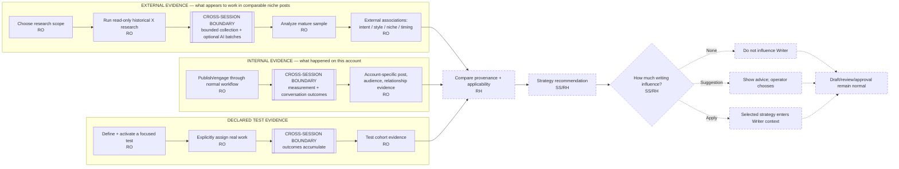
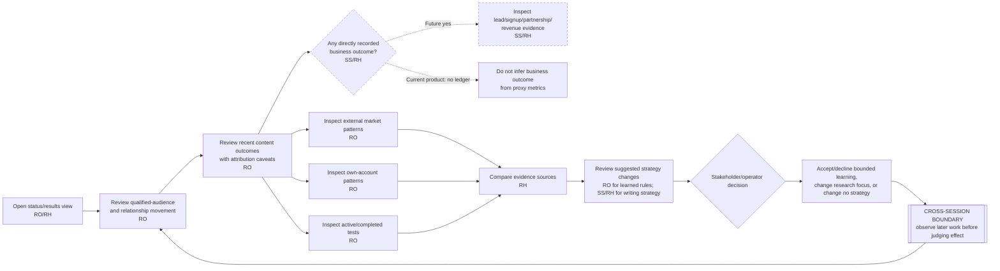

# Journey Maps

These journey maps describe current and proposed user journeys across the product. They are derived from repository inspection and stakeholder-stated direction; they are **not** usability findings.

## Evidence discipline

- **RO — Repository-observed:** implemented product behavior or authority.
- **SS — Stakeholder-stated:** desired product purpose/constraint.
- **RH — Research hypothesis:** an expected mental model or future placement that must be tested.

A dashed node/edge in a Mermaid map denotes future/hypothesized behavior rather than a current product capability.

## 1. Daily operator journey

**User goal:** open the product, understand what deserves attention, make the next useful decision, and leave the system in a truthful state.

```mermaid
flowchart LR
  A[Open workspace<br/>RO] --> B{Anything needs attention?<br/>RO}
  B -->|Editorial opportunity| C[Understand why now,<br/>source, evidence, format<br/>RO]
  B -->|Conversation| D[Understand what I can add<br/>RO]
  B -->|Draft/review| E[Review exact content<br/>RO]
  B -->|Nothing urgent| F[Discover a new signal<br/>or inspect results<br/>RO]

  C --> G{Human decision<br/>RO}
  G -->|Select| H[Route into research,<br/>post, or conversation work<br/>RO]
  G -->|Dismiss| I[Recommendation dismissed<br/>RO]
  D --> H
  F --> H

  H --> J[Generate/edit/save draft<br/>RO]
  J --> E
  E --> K[Check readiness + required<br/>human confirmations<br/>RO]
  K --> L{Approve?<br/>RO}
  L -->|No| J
  L -->|Reply| M[Explicitly send exact<br/>approved reply<br/>RO]
  L -->|Main feed| N[Approved — waiting / planned<br/>RO]

  N --> O[[CROSS-SESSION BOUNDARY<br/>scheduled wait / automation poll]]
  O --> P[Publication transport<br/>RO]
  M --> Q[Published/sent truth state<br/>RO]
  P --> Q
  P --> R[Failed or reconciliation state<br/>RO]
  M --> R

  Q --> S[[CROSS-SESSION BOUNDARY<br/>later measurement windows]]
  S --> T[Review outcomes later<br/>RO]
  T --> U[Own-account learning / tests<br/>RO]

  classDef future stroke-dasharray: 6 4;
```

### Journey interpretation

| Stage | Operator question | Current evidence | Research risk |
|---|---|---|---|
| Orient | “What needs me?” | Today mixes recommendations, counts, attention cards, status, and next scheduled work. | Users may scan every destination anyway or misread “worth looking at” as mandatory. |
| Understand | “Why is this worth doing?” | Editorial/Conversation/Discover surfaces expose rationale and source context. | Rationale may be too technical or too distributed to support a fast decision. |
| Decide | “What should I do with it?” | Selection/routing is explicit. | Recommendation, selection, and route may collapse into one perceived AI decision. |
| Prepare | “Is this the exact thing I want public?” | Draft is editable; quality/gates update. | Score/gates may look like system authorization rather than feedback. |
| Authorize | “What will this click do?” | Review, approval, reply-send, and main-feed publication are separate backend states. | Highest-consequence comprehension risk. |
| Wait | “Is anything happening without me?” | Main-feed automation can publish later only when enabled and approved/eligible. | “Approved,” “scheduled,” and “will publish” may be conflated. |
| Recover | “Did it actually go out?” | Transport/local-recording failures remain explicit. | User may retry an action that already reached X. |
| Learn | “Did it work?” | Measurements arrive later; Results/Experiments show descriptive evidence. | Immediate interactions may be mistaken for final or causal outcomes. |

### Cross-session boundaries that must remain visible

1. **Scheduled publication:** main-feed approval can be followed by a wait until a recommended/human time and a later automation cycle.
2. **Transport:** publication/send can outlive the initiating UI interaction and can produce failure/reconciliation states.
3. **Measurement:** fixed-window outcomes are captured later, not at publication time.
4. **Learning:** learned suggestions require later accumulated evidence and a separate human acceptance decision.

## 2. Editorial content journey

**User goal:** turn a credible opportunity into useful content while preserving the distinction between recommendation, selection, writing, approval, and publication.

```mermaid
flowchart LR
  A[Source snapshots<br/>RO] --> B[Editorial scan + research<br/>RO]
  B --> C[AI recommendation<br/>PREPARE / RESEARCH_MORE / SKIP<br/>RO]
  C --> D{Human selection<br/>RO}

  D -->|Research more| E[Attach/collect evidence<br/>RO]
  E --> F{Choose later content route<br/>RO}
  D -->|Prepare| F
  D -->|Dismiss| Z[Stop pursuing this recommendation<br/>RO]

  F --> G[Optional writing-strategy<br/>choice before generation<br/>SS/RH]
  G -.->|Off / Suggest / Apply<br/>labels unvalidated| H[Writer packet + generation<br/>future influence only]
  F --> H2[Writer generation with current<br/>editorial/evidence context<br/>RO]
  H -.-> I[Editable draft]
  H2 --> I

  I --> J[Quality feedback +<br/>content/media gates<br/>RO]
  J --> K{Human review & approval<br/>RO}
  K -->|Revise| I
  K -->|Approve main feed| L[Approved, not published<br/>RO]

  L --> M[Advisory schedule / human override<br/>RO]
  M --> N[[CROSS-SESSION BOUNDARY<br/>wait until eligible]]
  N --> O[Automation claims item only if<br/>auto-publishing enabled<br/>RO]
  O --> P[X publication transport<br/>RO]
  P --> Q[Published / failed / reconciliation<br/>RO]

  Q --> R[[CROSS-SESSION BOUNDARY<br/>15m / 1h / 6h / 24h measurements]]
  R --> S[Results + editorial outcome cohorts<br/>RO]
  S --> T[[CROSS-SESSION BOUNDARY<br/>later repeated evidence]]
  T --> U[Suggested learned rule<br/>RO]
  U --> V{Human accepts?<br/>RO}
  V -->|No| W[Zero production effect<br/>RO]
  V -->|Yes| X[Bounded recommendation influence<br/>RO]

  classDef future stroke-dasharray: 6 4;
  class G,H future;
```

### Authority checkpoints

| Checkpoint | Who/what has authority now? | What has **not** happened |
|---|---|---|
| AI recommendation | AI supplies advisory recommendation and evidence/rationale. | No route selected, no approval, no publication. |
| Human selection | Human chooses a recommendation/route. | Content is not approved or published. |
| Writer generation | AI proposes editable wording from supplied context. | Final authorship/approval remains human. |
| Readiness check | Draft gates evaluate current text + confirmations. | No approval or publication. |
| Approval | Human authorizes exact main-feed content to enter approved state. | Publication may still wait and may never happen if automation is off/blocked. |
| Schedule | Scheduler/human sets timing context. | Timing does not override approval, expiry, or eligibility. |
| Publication transport | Automation + X transport perform the side effect. | Success is not assumed until authoritative output is recorded. |
| Learned-rule acceptance | Human permits a bounded future recommendation adjustment. | It cannot send, approve, publish, bypass expiry, or override manual route/schedule. |
| Future strategy selection | **SS/RH:** human chooses whether writing guidance influences generation. | It must not become approval/publication authority. |

### Research questions

- Can users state the difference between “recommended format” and “selected format” before any explanation?
- Does `RESEARCH_MORE` feel like a useful intermediate decision or a dead-end state?
- Do people expect “Apply strategy” to modify only generation, or the whole account/system?
- Does schedule language communicate “planned/eligible” instead of “guaranteed”?
- After a publication failure, can users tell whether the transport side effect occurred?

## 3. Viral / Learn journey

**User goal:** understand current external patterns, compare them with this account's own evidence, and decide whether any strategy should change.

### Evidence lanes must remain distinct

| Lane | Repository-observed source | Question it can answer | Claim it cannot support by itself |
|---|---|---|---|
| External market evidence | Viral Styles research | “Which text-supported presentation patterns are associated with stronger performance in this selected comparable sample?” | “This style will make our post go viral.” |
| Internal account evidence | Results measurements, relationships, audience observations, editorial cohorts, learned rules | “What repeatedly happened around our own work?” | “This pattern universally works on X.” |
| Declared test evidence | Experiments + measurements | “Within this explicit comparison, what descriptive difference is observable and how much evidence exists?” | “The variant caused the outcome” or “the system automatically found a winner.” |
| Future strategy recommendation | SS/RH synthesis | “Given specific evidence and the current opportunity, what writing strategy might be useful?” | Approval, publication, or silent autonomous strategy change. |

### Current/future boundary

**Repository-observed:** external research, internal outcome evidence, tests, and accepted/suggested learned rules exist today, but they are distributed across Viral Styles, Performance, Experiments, and contextual recommendation surfaces.

**Stakeholder-stated / research hypothesis:** a future Learn destination may make the evidence architecture easier to understand with four user-facing concepts:

- Current winning styles;
- What works for you;
- Tests;
- Strategy recommendations.

This grouping is explicitly unvalidated. `IA_RESEARCH.md` defines how to falsify it.

### Cross-session boundaries

- Historical Viral research continues through collection, optional AI intent batches, analysis, and export; stop occurs between bounded units.
- Internal performance evidence cannot exist until publication/conversation outcomes are observed later.
- Tests need completed assigned work before evidence can accumulate.
- Strategy recommendations should not imply freshness if underlying evidence is stale or insufficient.

## 4. Stakeholder journey

**User goal:** answer “is this system producing the right kind of growth, what are we learning, and what decision should we make next?” without performing daily operator tasks.

### Stakeholder evidence questions

A stakeholder should be able to answer, with provenance:

1. Is the observed audience becoming more aligned with the target niche?
2. Are conversations creating useful continuation or relationship outcomes?
3. What happened to recent published work at comparable measurement windows?
4. Which observations are only associated with a publication window?
5. What external intent/style patterns appear to be working in the selected market sample?
6. What patterns recur in this account's own evidence?
7. Which tests are active, what was explicitly assigned, and how much evidence exists?
8. Which learned changes are suggested versus accepted?
9. What direct business outcomes have actually been recorded?

**Current gap:** question 9 cannot be answered from a dedicated business-outcome ledger because no such ledger exists in the current repository.

## Research focus by journey stage

| Journey stage | Primary method | What to observe | Device requirement |
|---|---|---|---|
| Orientation / next action | Moderated task walkthrough | first destination, interpretation of priority, “nothing to do” comprehension | Desktop + phone |
| Editorial choice | Think-aloud scenario | recommendation vs selection, format reasoning, research-more comprehension | Desktop + phone |
| Draft/review/approval | Consequence-prediction tasks | expected side effect before click; exact text authority; recovery | Desktop + phone for review essentials |
| Scheduled wait/publication | State-transition scenario | whether user expects guaranteed/immediate publication; failure interpretation | Desktop + phone |
| External learning | IA + task walkthrough | external provenance, scope setup, intent/style vocabulary | Desktop; phone for findings retrieval |
| Internal learning/tests | IA + evidence-comparison task | external/internal/test separation, evidence confidence | Desktop + phone |
| Stakeholder status | Read-only scenario | qualified-growth proxy vs business outcome, causal overclaiming | Desktop + phone |
| Advanced settings | Tree test / findability task | advanced controls remain findable but not default path for ordinary work | Desktop + phone |

## What these maps do not assert

- They do not show observed satisfaction, difficulty, emotion, or completion rates.
- They do not claim the proposed Learn structure is better than the current navigation.
- They do not claim users prefer any lifecycle term.
- They do not claim external or internal evidence predicts a future post outcome.
- They do not add new approval, publication, send, or strategy authority.
