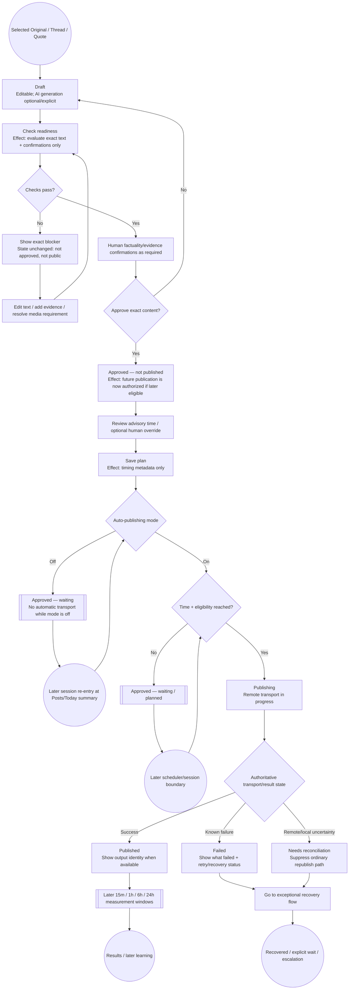
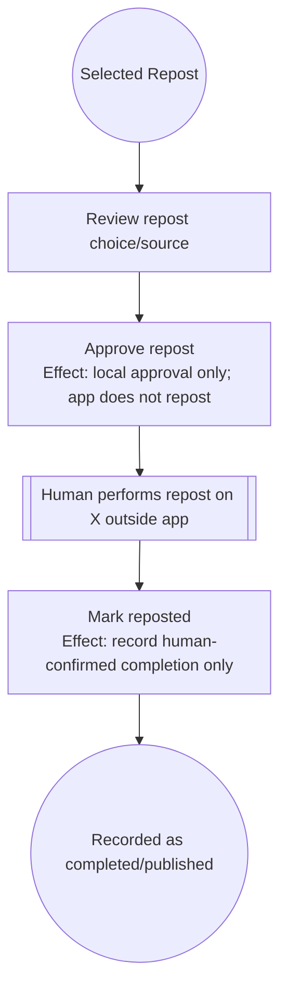
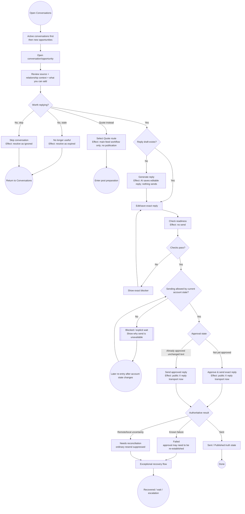

# Task Flows — Wave 2 Low-Fidelity Prototype

**Scope:** goal-level flows derived from the frozen Wave-1 interaction contracts. These flows are prototypes for evaluation, not participant findings and not a final IA decision.

## Evidence and prototype legend

- **[RO] Repository-observed** — current product capability or authority exists in the repository.
- **[P] Prototype behavior** — proposed presentation or recomposition of existing capabilities to test. It is not validated user preference.
- **[F] Future contract** — required by the UX/HCI program but not implemented in the current product.
- **[H1] / [H2]** — alternate IA hypotheses from `docs/ux/IA_RESEARCH.md`; both remain testable.

The current product code is unchanged from the Wave-1 React baseline. These flows do not add backend authority.

## Frozen authority sequence

Keep these states distinct in every prototype:

`recommendation -> human selection -> draft/review -> human approval -> schedule/wait -> publish/send transport -> published/sent result`

For replies:

`recommendation/opportunity -> human selection -> draft/review -> human approval -> explicit send -> sent result`

A future writing-strategy choice sits before generation and never gains approval, scheduling, send, publication, experiment-assignment, or learned-rule-acceptance authority.

## Consequence-preview rule

Before a consequential control is activated, the prototype must state the immediate effect in plain language. Exact labels remain research stimuli, but the semantics do not.

| Prototype action concept | Immediate effect that must be visible before activation |
|---|---|
| Select/use recommendation | Records a human workflow choice and opens the selected work. Does not generate, approve, send, or publish. |
| Choose content type | Routes the work to Original, Thread, Quote, Reply, Repost, Research, Pause, or Skip. No public action. |
| Generate draft | Runs AI generation and saves editable text. Does not approve, send, or publish. |
| Check readiness | Evaluates current text and required confirmations. Does not approve, send, or publish. |
| Approve main-feed post | Marks the exact content approved. It is not public yet. |
| Save/change publishing plan | Changes timing/expiry metadata only. Does not approve or publish. |
| Send exact reply | Performs the public X reply transport now. |
| Mark reposted | Records that the human already reposted on X. It does not perform the repost. |
| Accept learned change | Activates a bounded future recommendation adjustment. Does not approve/send/publish content. |
| Apply writing strategy [F] | Allows selected writing guidance to influence one generation. Does not approve/send/publish content. |

## Draft-consequence normalization used by these prototypes

**[RO] Current inconsistency:** Today `Draft this` selects/routes and creates a scaffold without running Writer generation; Discover `Draft …` can route and run initial AI generation in the same action.

**[P] Prototype repair:** separate the user-visible concepts even if later implementation reuses existing route/generation endpoints:

1. **Select/use as {content type}** — workflow choice only.
2. **Generate draft** — explicit AI-generation action.

This prototype does not require a new backend action. The repository already has separate routing and draft-generation authorities; the current Discover UI simply bundles them.

---

## Flow 1 — Daily orientation: obligations versus advisory opportunities

**Job:** identify real open obligations, distinguish them from advice, and take one safe next action.

**Current capability:** [RO] Today already exposes attention actions, account state, editorial recommendations, and outcome summaries. The P1 defect is that advisory Editorial Plan appears before the actual attention list counted by the Today headline.

**Prototype behavior:** [P] present open human obligations as a distinct decision queue and advisory opportunities as a separate secondary region. Exact heading words/order remain testable, but obligation/advice semantics must be explicit.

```mermaid
flowchart TD
    START((Open product)) --> TODAY[Today\n[P] Distinct obligations + advisory areas]
    TODAY --> OBL{Any open human obligations?\n[RO state]}

    OBL -- Yes --> NEED[Open one obligation\nWhat / Why now / What can I do / What happens next]
    NEED --> KIND{Obligation type}
    KIND -- Draft review --> POST[Open draft / post lifecycle]
    KIND -- Conversation --> CONV[Open conversation]
    KIND -- Account constraint --> STATUS[Open account-status detail]
    KIND -- Approved/waiting post --> PLAN[Open post lifecycle / publishing plan]

    POST --> DECIDE{Take action now?}
    CONV --> DECIDE
    STATUS --> DECIDE
    PLAN --> DECIDE

    DECIDE -- Yes --> PREVIEW[Show immediate effect before activation]
    PREVIEW --> ACT[Perform authorized action]
    ACT --> FEEDBACK[Show new authoritative state + next step]
    FEEDBACK --> TODAY
    DECIDE -- Later --> WAIT[[Explicit wait / leave obligation visible]]
    WAIT --> ENDWAIT((Exit session with state unchanged))

    OBL -- No --> ADVICE[Advisory Editorial opportunities\n[P] clearly labeled as optional]
    ADVICE --> WORTH{Worth pursuing?}
    WORTH -- Yes --> REC[Open recommendation flow]
    WORTH -- No --> DISCOVER{Want new signals/results?}
    DISCOVER -- Discover --> DS[Open Discover]
    DISCOVER -- Results --> RS[Open Results]
    DISCOVER -- Neither --> DONE((Done / caught up))
```

**Terminating states:** action completed with updated state; explicit wait; another task area; caught up/exit.

**Evaluation questions:**

- Can a participant point to the items that already require a decision before inspecting optional advice?
- When no obligation exists, does the advisory area still feel useful rather than urgent?
- Can the participant state what will happen before activating the selected obligation action?

---

## Flow 2 — Editorial recommendation: recommendation -> selection -> preparation, not approval

**Job:** understand a recommendation, choose/override the treatment, select or dismiss it, and enter preparation without implying that generated copy or approval already exists.

**Current capability:** [RO] recommendations can be `PREPARE`, `RESEARCH_MORE`, or `SKIP`; selection records provenance/routes work and does not approve/publish. Current Today text-route selection does not run Writer generation.

**Prototype behavior:** [P] use a consequence-explicit selection step, then a separate generation step for authored routes. Valid human content-type override remains available.

```mermaid
flowchart TD
    REC((Editorial recommendation)) --> UNDERSTAND[What is it?\nWhy now?\nEvidence + limitations\nRecommended treatment]
    UNDERSTAND --> DECISION{Human decision}

    DECISION -- Dismiss --> DISMISS[Dismiss recommendation\nEffect: persisted dismissal; no public action]
    DISMISS --> EXIT((Exit recommendation))

    DECISION -- Research more --> SELECTR[Select Research\nEffect: enters research workflow only]
    SELECTR --> RESEARCH[Collect/attach evidence]
    RESEARCH --> LATER[[Explicit later decision boundary]]
    LATER --> UNDERSTAND2[Re-evaluate with stronger evidence]
    UNDERSTAND2 --> DECISION2{Prepare something now?}
    DECISION2 -- No --> EXIT
    DECISION2 -- Yes --> TYPE

    DECISION -- Prepare --> TYPE{Choose/accept content type}
    TYPE -- Original --> SEL[Select Original\nEffect: route only; no generation/approval]
    TYPE -- Thread --> SELT[Select Thread\nEffect: route only; no generation/approval]
    TYPE -- Quote --> SELQ[Select Quote\nEffect: route only; no generation/approval]
    TYPE -- Reply --> SELR[Select Reply\nEffect: route only; no send]
    TYPE -- Repost --> SELP[Select Repost\nEffect: prepare manual repost workflow only]

    SEL --> STRAT{Optional writing strategy?\n[F] point-of-use contract}
    SELT --> STRAT
    SELQ --> STRAT
    SELR --> STRAT

    STRAT --> GEN[Generate draft\nEffect: saves editable AI text; no approval/public action]
    GEN --> DRAFT[Open editable draft / conversation reply]
    DRAFT --> END((Enter normal review lifecycle))

    SELP --> REPOST[Open repost preparation\nNo authored-body generation]
    REPOST --> END2((Enter repost review lifecycle))
```

**SKIP recommendations:** [RO] SKIP is not selected into workflow; the user may dismiss it or leave it as advisory history according to the existing recommendation status model.

**Terminating states:** dismissed; research wait; authored draft; repost preparation.

**Evaluation questions:**

- Does the selection control communicate that no copy is generated yet?
- Can the participant distinguish recommended type from their selected type?
- Does `Research more` read as an intermediate workflow rather than a dead end?

---

## Flow 3 — Main-feed post lifecycle: draft -> approval -> wait -> publication truth

**Job:** move a post through review and publication while always recognizing the current lifecycle state.

**Current capability:** [RO] Draft/edit, readiness checks, approval, schedule recommendation/override, automation eligibility, `publishing`, `published`, and `failed` are separate authoritative states. Main-feed approval is not publication; no ordinary React `Publish now` exists.

**Prototype behavior:** [P] render the same lifecycle summary wherever the work appears, so the user does not need to remember which module owns the next transition.



### Repost branch

**[RO]** Repost has no authored body and is manual on X.



**Terminating states:** published; failed/recovery; reconciliation wait/escalation; explicit approved wait.

**Evaluation questions:**

- Can a returning user explain the difference among Draft, Needs review, Approved/waiting, Publishing, Published, and Failed?
- Does approval still look distinct from publication when automation is on?
- Can the user find the current state after re-entering a later session without reconstructing module ownership?

---

## Flow 4 — Conversation lifecycle: prepare -> approve -> explicit send

**Job:** choose a worthwhile conversation, prepare the exact reply, and send only through an explicit human action.

**Current capability:** [RO] Conversations separates active conversations from new opportunities; contribution/source/relationship context exists; reply generation/editing/readiness and explicit send exist. Replies are not scheduled.



**Terminating states:** sent; skipped/expired; quote-post handoff; blocked wait; recovery/escalation.

**Evaluation questions:**

- Can the user say when the public X side effect will occur?
- Does an edited approved reply clearly require fresh approval before send?
- When sending is blocked, does the user understand that the draft remains intact and unsent?

---

## Flow 5 — Exceptional recovery: deterministic blocker, safe retry, remote/local uncertainty

**Job:** know what failed, whether anything changed remotely, whether retry is safe, and what to do next.

**Current capability:** [RO] deterministic draft blockers, fetch/AI/research errors, failed publication/send states, and remote-success/local-recording uncertainty exist. Partial-success reply errors can leave authoritative state `publishing` while the current client snapshot remains stale until another read.

**Prototype behavior:** [P] recovery presentation always exposes four fields: **operation**, **remote-effect status**, **current authoritative state**, and **safe next step**. It never shows an ordinary resend/re-publish control while remote success is uncertain.

```mermaid
flowchart TD
    ERROR((Something did not complete normally)) --> CLASS{Failure class from authoritative owner}

    CLASS -- Deterministic pre-action blocker --> B1[Show blocker\nRemote effect: none\nState: unchanged]
    B1 --> FIX[Fix content/evidence/setting]
    FIX --> RETRYCHECK[Re-run readiness/check]
    RETRYCHECK --> BEND((Resolved or remains blocked))

    CLASS -- Safe retryable non-public operation --> S1[Show failed operation\nRemote public effect: none\nRetry: safe]
    S1 --> RETRY{Retry now?}
    RETRY -- Yes --> S2[Retry same bounded read/AI/research operation]
    S2 --> SRESULT{Result}
    SRESULT -- Success --> SEND((Continue task))
    SRESULT -- Failed --> S1
    RETRY -- No --> SWAIT[[Explicit wait / exit]]

    CLASS -- Public transport attempted --> P1[Immediately suppress ordinary send/publish action]
    P1 --> READ[Refresh/read authoritative work state\n[RO read capability]]
    READ --> STATE{What is now known?}

    STATE -- Published/sent confirmed --> P2[Show success truth + output identity]
    P2 --> PEND((Done))

    STATE -- Failure with no completed remote result confirmed by owner --> P3[Show failed state\nExplain whether fresh approval is required]
    P3 --> SAFE{Owner says retry is safe?}
    SAFE -- Yes --> PREP[Return through normal review/approval path\nNo blind resend]
    PREP --> PEND2((Recovery path resumed))
    SAFE -- No --> ESC[Escalate / inspect external truth]
    ESC --> PWAIT[[Explicit wait / manual reconciliation]]

    STATE -- Publishing / remote success possible or known but local recording incomplete --> P4[Reconciliation state\nRemote action may already exist\nDo not resend]
    P4 --> ID{Remote output identity known?}
    ID -- Yes --> INSPECT[Offer read-only link/identity inspection]
    ID -- No --> NOID[State identity unavailable]
    INSPECT --> WAITREC[[Refresh later / manual reconciliation owner]]
    NOID --> WAITREC
    WAITREC --> REREAD[Read authoritative state again]
    REREAD --> STATE
```

### Recovery contract shown to the evaluator

| Recovery class | What the prototype may offer | What it must not offer |
|---|---|---|
| Deterministic blocker | Fix + recheck | Approval/send while blocker remains |
| Safe retryable non-public failure | Retry same bounded operation | Claim that public state changed |
| Known failed public transport | Normal review/approval path only when authoritative owner says retry is safe | Blind resend from stale client state |
| Remote/local uncertainty | Refresh, inspect known output identity, wait/escalate/reconcile | Ordinary resend/re-publish action |

**No new backend reconciliation mutation is invented here.** A dedicated future reconciliation action remains a research/implementation question; the prototype can test whether an authoritative refresh plus explicit manual escalation is sufficient.

---

## Flow 6 — Historical Viral research: simple default, advanced depth available

**Job:** study external writing patterns without requiring runtime/model/sampling expertise.

**Current capability:** [RO] bounded historical research, explicit niches/windows/thresholds/control counts, optional semantic AI, checkpoints, stop-after-current-unit, stored findings, and failures exist.

**Prototype behavior:** [P] ordinary setup asks for time window, niche scope, research depth, and whether semantic analysis is wanted. Exact mapping from Quick/Standard/Deep to technical sampling controls is deliberately **not** frozen in this document; it must preserve valid bounded research semantics and can be refined later.

**Navigation hypothesis:**

- **[H1]** entry: `Results -> What is working now`.
- **[H2]** entry: `Learn -> Current winning styles`.

```mermaid
flowchart TD
    START((Open external-pattern research\n[H1 or H2])) --> SCOPE[Choose time window + niches]
    SCOPE --> DEPTH{Research depth [P]}
    DEPTH -- Quick --> Q[Quick\nsmaller bounded study]
    DEPTH -- Standard --> ST[Standard\nrecommended default hypothesis]
    DEPTH -- Deep --> D[Deep\nlarger bounded study]

    Q --> SEM{Include communicative-intent/style AI analysis?}
    ST --> SEM
    D --> SEM
    SEM --> ADV{Need exact expert controls?}
    ADV -- Yes --> ADVANCED[Advanced setup\n[RO capabilities]: thresholds, max/query, controls, threads, exact AI profile/runtime/model/reasoning]
    ADV -- No --> SUMMARY
    ADVANCED --> SUMMARY[Review run summary\nWhat will be collected/analyzed]
    SUMMARY --> RUN[Run research\nEffect: starts read-only bounded background research]
    RUN --> PROGRESS[[Checkpoint progress\nMay outlive this interaction/session]]
    PROGRESS --> STOP{Stop requested?}
    STOP -- Yes --> STOPPING[Stop after current bounded unit]
    STOPPING --> STOPPED[Stopped\nSeparate this run from prior stored evidence]
    STOPPED --> ENDSTOP((Exit / start another run later))
    STOP -- No --> STATUS{Run result}
    STATUS -- Running --> PROGRESS
    STATUS -- Failed --> FAIL[Show failed stage + what data belongs to this run\nPrior stored evidence remains separately identified]
    FAIL --> RETRY{Retry a new run?}
    RETRY -- Yes --> SUMMARY
    RETRY -- No --> ENDFAIL((Exit))
    STATUS -- Complete --> FIND[Show strongest external patterns first\nintent + style + applicability + evidence class]
    FIND --> DETAIL[Evidence/sample/examples/limitations on demand]
    DETAIL --> DONE((External evidence available for comparison))
```

**Evaluation questions:**

- Can an ordinary user start a sensible study without opening Advanced?
- Do Quick/Standard/Deep communicate depth rather than truth/certainty?
- Can the user tell current-run findings from older stored evidence after stop/failure?

---

## Flow 7 — Learning comparison: external vs internal vs experiment evidence

**Job:** compare evidence sources without blending provenance or overclaiming causality.

**Navigation hypothesis:**

- **[H1]** the three evidence areas live under Results.
- **[H2]** the three evidence areas live as distinct children of Learn.

**Current capability:** [RO] external Viral evidence, internal account outcomes/learned rules, and explicit experiment evidence exist. They are currently distributed across Viral Styles, Performance, and Experiments.

**Prototype behavior:** [P] a comparison view may bring summaries together, but each evidence row retains its owner, time/sample context, strength, and limitations. No opaque combined score is introduced.

```mermaid
flowchart TD
    START((Question: should we change strategy?)) --> PICK{Evidence source to inspect}
    PICK -- External market --> EXT[External evidence\nComparable niche sample\nAssociation, not causation]
    PICK -- Own account --> INT[Internal evidence\nObserved account outcomes\nAttribution caveats]
    PICK -- Declared test --> EXP[Test evidence\nExplicit comparison + assignments\nNo automatic causal winner]

    EXT --> COMPARE[Comparison workspace [P]\nKeep three provenance lanes visible]
    INT --> COMPARE
    EXP --> COMPARE

    COMPARE --> ENOUGH{Enough relevant evidence to make a human decision?}
    ENOUGH -- No --> INSUFF[Mark insufficient / missing evidence\nDo not manufacture recommendation]
    INSUFF --> WAIT[[Collect more outcomes / run research / complete test]]
    WAIT --> START

    ENOUGH -- Conflicting --> CONFLICT[Show agreement/disagreement explicitly\nNo forced single conclusion]
    CONFLICT --> DECIDE{Human next step}
    DECIDE -- Keep current approach --> EXIT((No strategy change))
    DECIDE -- Gather more evidence --> WAIT
    DECIDE -- Inspect bounded existing learned suggestion --> LEARNED[Open suggested/accepted learned-rule evidence\n[RO] only qualified internal/test path can affect rule acceptance]
    LEARNED --> EXIT2((Separate learned-rule decision))

    ENOUGH -- Relevant pattern worth considering --> STRAT[Open writing-strategy recommendation [F]\nEvidence lanes remain separate]
    STRAT --> NEXT((Enter writing-strategy flow))
```

**Guardrail:** external evidence alone never becomes an accepted production learned rule. Existing learned-rule acceptance remains a separate human decision backed by its own qualified evidence semantics.

**Evaluation questions:**

- Can the participant tell which evidence came from outside posts, this account, and a declared test?
- When the sources disagree, does the prototype communicate disagreement instead of one synthetic score?
- Does H1 or H2 make the comparison easier to find without collapsing evidence ownership?

---

## Flow 8 — Future writing strategy: no influence / advice only / deliberate use

**Job:** decide whether evidence-backed writing guidance should influence one generation while preserving authorship and publication authority.

**Status:** [F] no current writing-strategy selection/persistence/application contract exists. Canonical behavior is frozen by Wave 1; final user-facing labels and placement are not.

### Canonical semantic modes

| Canonical value | Required behavior | Must not happen |
|---|---|---|
| `off` | Strategy guidance has no Writer-generation effect. | No hidden prompt influence. |
| `suggest` | Show strategy/evidence to the human; Writer generation remains unchanged. | Advice must not silently become generation instruction. |
| `apply` | Human explicitly allows selected intent/style guidance to shape this generation only. | No approval, send, publish, learned-rule acceptance, experiment assignment, or account-wide mode change. |

### Placement hypotheses to preserve

- **Evidence-first placement:** inspect/select from the strategy recommendation area under **[H1] Results** or **[H2] Learn**, then show/change the current selection at the draft.
- **Point-of-use placement:** Learn/Results provides evidence only; the actual `off|suggest|apply` decision lives at the draft immediately before generation.
- **Dual-responsibility placement:** Learn/Results owns evidence/recommendation; Draft owns the in-force mode and final change/remove action.

No placement is selected as final in this wave.

```mermaid
flowchart TD
    START((Open evidence-backed strategy recommendation\n[H1 Results or H2 Learn, or arrive from Draft])) --> EVIDENCE[Inspect intended communicative intent/style\nExternal + internal + test evidence shown separately\nLimitations visible]
    EVIDENCE --> FIT{Applicable to selected content type?}

    FIT -- Repost --> NA[Not applicable\nNo authored body; no strategy mode is applied]
    NA --> REPOST((Continue manual repost lifecycle))

    FIT -- Original --> MODE
    FIT -- Thread --> MODE
    FIT -- Quote --> MODE
    FIT -- Reply --> MODE

    MODE{Human chooses writing influence\nlabels provisional}
    MODE -- off --> OFF[No influence\nWriter receives no strategy instruction]
    MODE -- suggest --> SUG[Advice only\nGuidance remains visible; Writer unchanged]
    MODE -- apply --> APP[Deliberately use\nSelected intent/style may shape this generation only]

    OFF --> GEN[Generate/edit Original / Thread / Quote / Reply]
    SUG --> GEN
    APP --> GEN
    GEN --> PROV[Draft shows in-force mode + whether strategy influenced generation\nEvidence provenance inspectable]
    PROV --> REVIEW[Review actual wording + factual/evidence gates]
    REVIEW --> KEEP{Keep current strategy choice?}
    KEEP -- Yes --> NORMAL[Continue normal readiness / approval / send-publication lifecycle]
    KEEP -- Change mode / remove --> CHANGE[Choose off/suggest/apply again]
    CHANGE --> REGEN{Regenerate?}
    REGEN -- Yes --> GEN
    REGEN -- No --> REVIEW
    NORMAL --> END((Strategy authority ends at writing influence; normal content authority remains))
```

### Pipeline realization requirement

The same strategy is not a copy template:

- **Original:** may shape opening, structure, explanatory intent, or presentation style.
- **Thread:** may shape thread arc/intent while preserving thread-specific constraints.
- **Quote:** may shape the operator's additive commentary, never the quoted source.
- **Reply:** may shape the response approach while preserving exact source/conversation context and explicit send authority.
- **Repost:** `not_applicable`; there is no authored body to influence.

**Evaluation questions:**

- Do participants understand `suggest` as zero Writer effect?
- Do they understand `apply` as one-generation writing influence rather than a global mode?
- Where do participants expect to make the choice: evidence area, draft, or both?
- Can they change/remove guidance without thinking approval or recommendation state changed?

---

## Coverage and termination check

| Required job | Flow | Success/recovery/wait/exit termination present? |
|---|---|---|
| Daily orientation | 1 | Yes — completed action, explicit wait, Discover/Results handoff, or caught-up exit |
| Editorial recommendation | 2 | Yes — dismiss, research wait, draft/reply preparation, repost preparation |
| Post lifecycle | 3 | Yes — published, explicit approved wait, recovery/reconciliation, later measurement |
| Conversation lifecycle | 4 | Yes — sent, skip/expire, quote handoff, blocked wait, recovery |
| Exceptional recovery | 5 | Yes — resolved, safe retry, explicit wait, or escalation/reconciliation |
| Historical Viral research | 6 | Yes — complete findings, stopped, retry, or failure exit |
| Learning comparison | 7 | Yes — no change, more-evidence wait, learned-rule decision, or strategy handoff |
| Writing strategy | 8 | Yes — normal lifecycle handoff or Repost not-applicable |

## What remains deliberately unresolved

- Whether H1 or H2 is easier to find/navigate.
- Exact user-facing terms for obligations, advisory opportunities, evidence types, research depth, lifecycle states, and `off|suggest|apply`.
- Whether strategy selection belongs in Learn/Results, Draft, or both.
- Whether an authoritative refresh plus manual escalation is enough for specific reconciliation states or a dedicated future recovery action is required.
- Exact Quick/Standard/Deep research-control mappings.
- Whether bare recommendation/quality scores should appear in the first layer.

These require participant evidence or a later explicit provisional product decision.