# User Flows — Current C0 and H1/H2 Prototype Routes

**Scope:** route/surface-level movement for the Wave-2 prototype. This document maps where a user enters, acts, leaves, and later re-enters. It does not select a final IA and does not invent new backend authority.

## Legend

- **[RO]** current repository route/surface or current authority.
- **[P]** proposed prototype presentation/flow using current capabilities where possible.
- **[F]** future capability required by the source plan but not implemented.
- **C0** current eight-destination React IA.
- **H1** five-primary-destination hypothesis.
- **H2** six-primary-destination Learn hypothesis.

Logical H1/H2 destinations below are research stimuli, not committed hash routes. No `#/learn` or other new production route is asserted by this document.

## IA conditions used by the flows

### C0 — current React baseline [RO]

| Primary destination | Current route | Relevant secondary/detail routes |
|---|---|---|
| Today | `#/today` | Editorial Plan and attention cards are embedded |
| Discover | `#/discover` | Source/feed states embedded |
| Viral Styles | `#/viral` | Historical research setup/progress/findings embedded |
| Conversations | `#/conversations` | `#/conversations/:candidateKey` |
| Posts | `#/create` | `#/draft/:draftId` |
| Performance | `#/results` | `#/results/audience` |
| Experiments | `#/improve` | Tests + learned rules embedded |
| Diagnostics | `#/advanced` | `#/advanced/ai`, `#/advanced/niche`, legacy health/relationship detail |

### H1 — five-primary-destination hypothesis [P/RH]

```text
Today
Discover
Conversations
Posts
Results
  Overview
  Audience quality
  Recent content outcomes
  What is working now          [external evidence]
  What works for this account  [internal evidence]
  Tests                        [experiment evidence]
  Strategy recommendations     [future writing-strategy evidence]
  More
    AI Settings
    Niche / audience definition
    Relationships detail
    Account status / diagnostics
    Raw evidence / runtime detail
```

### H2 — six-primary-destination Learn hypothesis [P/RH]

```text
Today
Discover
Conversations
Posts
Results
  Overview
  Audience quality
  Recent content outcomes
  Conversation outcomes
Learn
  Current winning styles       [external evidence; label provisional]
  What works for you           [internal evidence; label provisional]
  Tests                        [experiment evidence]
  Strategy recommendations     [future writing-strategy evidence]
Support / utility entry (not a seventh primary destination)
Advanced / Settings
  AI Settings
  Niche / audience definition
  Relationships detail
  Account status / diagnostics
  Raw evidence / runtime detail
```

**Research isolation rule:** whenever an H1/H2 comparison is run, keep the task, authority, evidence, and page content equivalent. Change only the navigation grouping/path that the hypothesis is meant to test.

## Surface ownership versus summary/link placement

A summary may appear elsewhere, but the action owner should remain clear.

| User decision/action | Current authoritative surface/owner [RO] | Prototype summary/link may appear on |
|---|---|---|
| Review an open obligation | Target detail surface linked from Today | Today |
| Select/dismiss Editorial recommendation | Today Editorial Plan / editorial selection authority | Today; later evidence views may link back but do not select silently |
| Choose content route | Discover or Posts via current routing authority | Today recommendation handoff, Discover, Posts |
| Generate/edit draft | Draft detail or Conversation detail | Today/Discover/Posts may link to it |
| Check readiness / approve main-feed content | Draft detail and current Posts approval surface | Posts lifecycle summary, Today obligation |
| Change publication timing | Posts publishing-plan surface | Today/Draft may summarize/link |
| Main-feed publication transport | Background automation after approval/eligibility | Today/Posts/Results may report state; no prototype `Publish now` authority |
| Send reply | Conversation detail | Today may link; Draft may summarize and hand off |
| Inspect external evidence/run Viral research | C0 Viral Styles; H1/H2 location under test | Results/Learn according to condition |
| Inspect internal account evidence | C0 Performance + Experiments; H1/H2 location under test | Results/Learn according to condition |
| Create/assign test; accept/retire learned rule | C0 Experiments; H1/H2 location under test | Results/Learn according to condition |
| Review measured results | Performance/Results | Today may summarize |
| Configure AI/niche/diagnostics | Current Diagnostics/settings; H1/H2 placement under test | Contextual links may appear from relevant task |

---

## User Flow 1 — Daily orientation and one next action

### C0 baseline [RO]

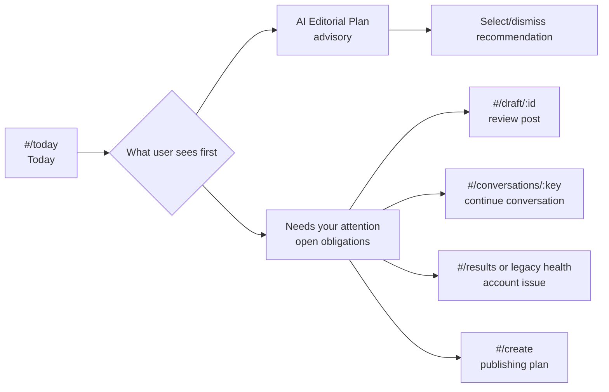

**Baseline issue:** Editorial Plan precedes the obligation list even though Today's `taskCount` counts the latter.

### H1 and H2 prototype [P]

Navigation does not materially differ for this task. Both conditions start at **Today**.

```mermaid
flowchart LR
    T[Today] --> O[Needs a human decision\n[P] obligations clearly separated]
    T --> A[Advisory opportunities\n[P] optional, not counted as obligations]
    O --> X{Open obligation}
    X --> D[Draft/Post detail]
    X --> C[Conversation detail]
    X --> S[Account/status detail]
    X --> P[Posts lifecycle]
    A --> R[Recommendation flow]
    D --> BACK[After action: authoritative state + next step]
    C --> BACK
    S --> BACK
    P --> BACK
    R --> BACK
    BACK --> T
```

**Phone expectation:** the same distinction must survive a compact navigation treatment and vertical stacking; no horizontal scan should be required to discover that an obligation exists.

---

## User Flow 2 — Editorial recommendation -> human selection -> draft preparation

### C0 baseline [RO]

```text
#/today
  -> Editorial recommendation
     -> Today `Draft this` / `Open conversation` / `Prepare repost` / `Open research`
        -> selection + workflow route
        -> #/draft/:id OR #/conversations/:key OR #/create
```

For authored text selected from Today, Writer generation is still a separate action after the selection. Discover currently bundles routing + initial generation for new authored drafts.

### H1/H2 prototype [P]

The task path is intentionally identical across H1/H2 because the IA hypothesis is not about editorial authority.

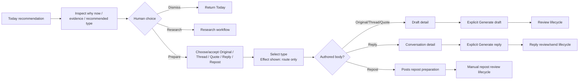

**Prototype recomposition:** separate route selection from generation using existing route/generation authorities. This is a proposed interaction change, not a new API contract.

---

## User Flow 3 — Post lifecycle and cross-session publication re-entry

### C0 baseline [RO]

```text
#/draft/:id     edit/check/approve
   -> #/create  publishing plan / lifecycle groups
      -> [background automation boundary if enabled]
         -> #/create and/or #/draft/:id for published/failed state
            -> #/results later for measurements
```

### H1/H2 prototype [P]

Primary destination remains **Posts** in both hypotheses. The repair is object-level lifecycle visibility, not a navigation change.

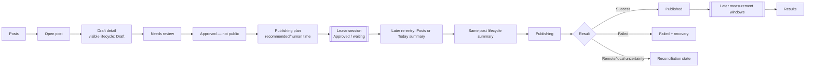

**Re-entry requirement:** Today may summarize “next post” or a failure, but Posts remains the place where the complete post lifecycle is recognizable. A returning user should not need to remember that approval lived on Draft while scheduling lived elsewhere.

---

## User Flow 4 — Conversation preparation and explicit send

### C0 baseline [RO]

```text
#/conversations
  -> #/conversations/:candidateKey
     -> generate/edit embedded reply draft
     -> readiness
     -> explicit `Approve & send exact reply` OR `Send approved reply`
     -> sent / failed / publishing-reconciliation state
```

### H1/H2 prototype [P]

No navigation difference is introduced. **Conversations** owns reply send in both hypotheses.

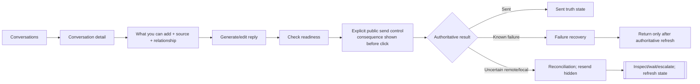

**Standalone reply Draft route:** if reached through a deep link, it should summarize state and hand the user to Conversation detail for send rather than duplicate send authority.

---

## User Flow 5 — Partial remote/local failure and safe recovery

### C0 baseline [RO]

Current action errors can carry precise backend messages, but mutation errors do not always invalidate/refetch the current detail. A reply may therefore be authoritative `publishing` while the current React snapshot still resembles the pre-send state.

### H1/H2 prototype [P]

Recovery ownership is attached to the affected work object, so IA does not materially differ.

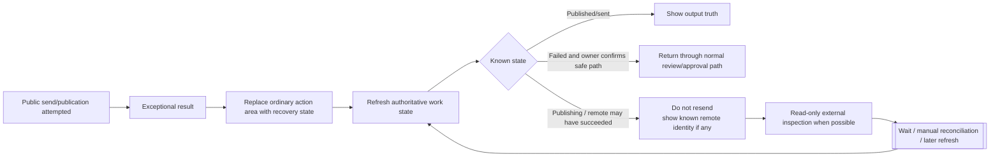

**Important:** this prototype does not invent a new `reconcile` mutation. It tests a safe presentation contract around existing authoritative reads and explicit escalation. A dedicated recovery action remains an implementation/research question.

---

## User Flow 6 — Historical Viral research under C0, H1, and H2

The task behavior is held constant; only entry/navigation differs across conditions.

### C0 baseline [RO]

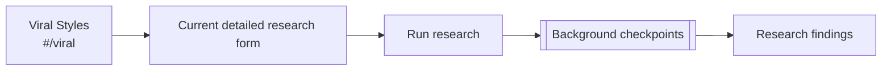

### H1 route hypothesis [P/RH]

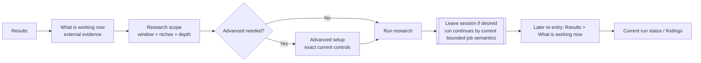

### H2 route hypothesis [P/RH]

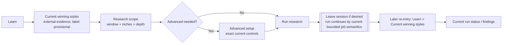

**Cross-session requirement:** re-entry must distinguish the active/latest run from older stored evidence and retain stop-after-current-unit semantics.

---

## User Flow 7 — Compare external, internal, and experiment evidence

### C0 baseline [RO]

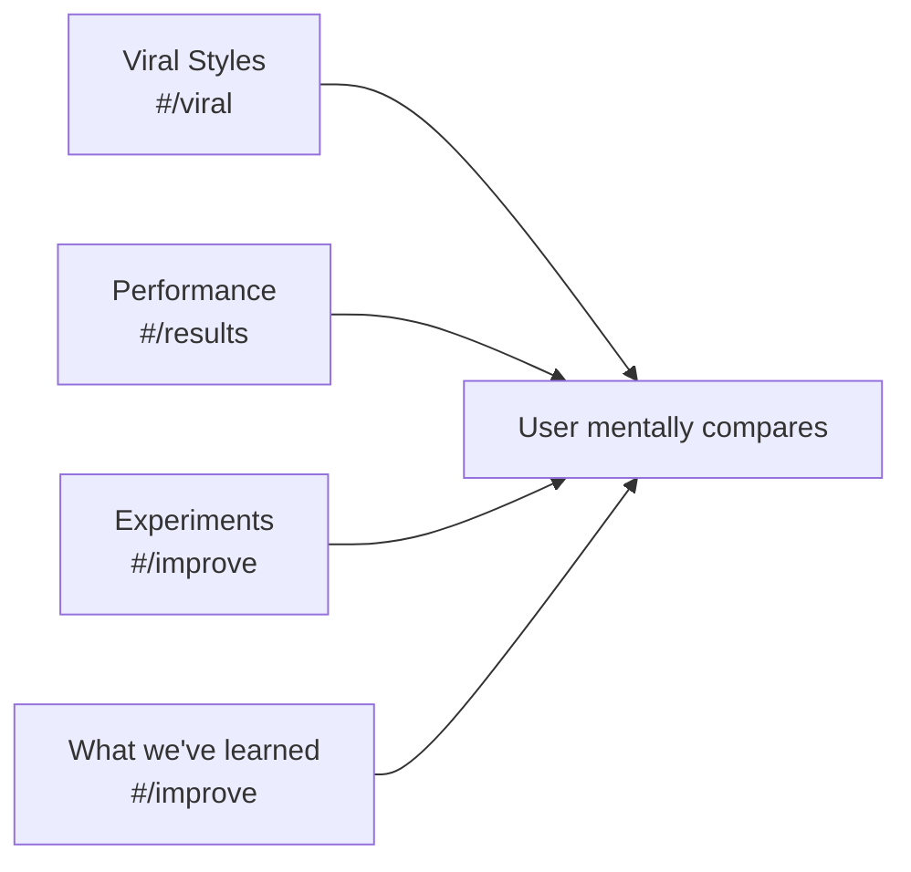

Current evidence exists but is distributed. There is no current draft-level writing-strategy synthesis.

### H1 route hypothesis [P/RH]

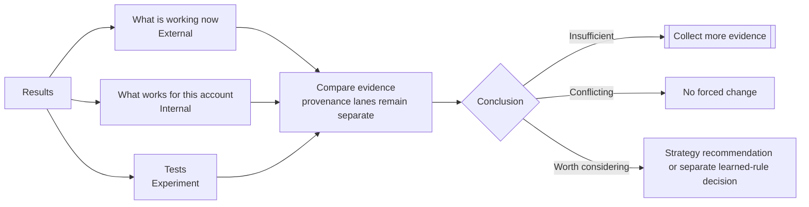

### H2 route hypothesis [P/RH]

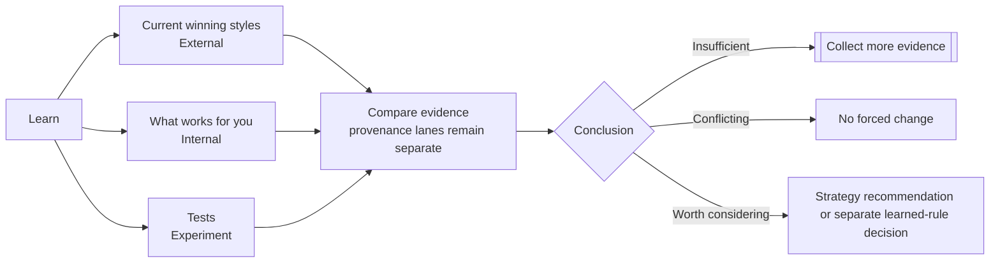

**Testing purpose:** H1 tests whether Results becomes too broad; H2 tests whether Learn improves findability without causing evidence lanes to collapse or being misread as education/help.

---

## User Flow 8 — Future writing-strategy placement and point of use

**Status:** [F] canonical behavior is fixed, placement and labels are not.

### Common semantic sequence

```text
inspect evidence -> understand applicability/limitations -> choose off|suggest|apply ->
generate/edit -> see whether guidance influenced this generation -> change/remove if desired ->
normal readiness/approval/send-publication flow
```

### IA entry differences

- **H1:** strategy evidence/recommendation is discoverable under `Results -> Strategy recommendations`.
- **H2:** strategy evidence/recommendation is discoverable under `Learn -> Strategy recommendations`.
- **C0:** no writing-strategy mode exists; current learned-rule evidence is under Experiments and external evidence is under Viral Styles.

### Placement hypothesis S1 — evidence area owns selection, draft mirrors/changes it [P/F]

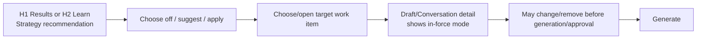

### Placement hypothesis S2 — draft owns selection; evidence area only explains [P/F]

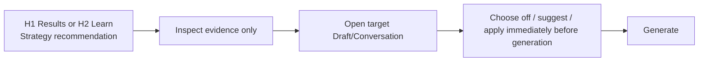

### Placement hypothesis S3 — dual responsibility [P/F]

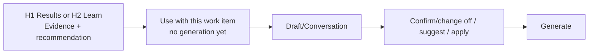

### Content-type routing

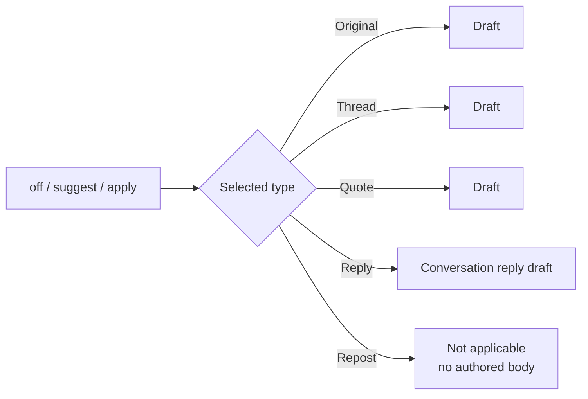

**Research purpose:** determine whether participants expect evidence management and the immediate writing-influence decision in the same place or at different moments. No placement is selected by preference.

---

## Cross-session re-entry map

The product has several legitimate delayed states. A flow that ends at the session boundary is incomplete unless the later re-entry is clear.

| Delayed process/state | Leaves session from | Later authoritative evidence | Prototype re-entry |
|---|---|---|---|
| Approved main-feed post waiting for time/eligibility | Post lifecycle | queue + schedule/automation state [RO] | Today summary may link; Posts shows complete lifecycle |
| Main-feed publication transport | Publishing state | queue/output transport state [RO] | Same post lifecycle; success/failure/reconciliation visible |
| Viral historical research | Research progress | current in-process job + stored external evidence [RO] | C0 Viral; H1 Results external area; H2 Learn external area |
| Fixed-window measurements | Published item | 15m/1h/6h/24h publication measurements [RO] | Results recent content outcomes |
| Conversation outcomes | Sent interaction | later relationship/conversation observations [RO] | Results/relationship evidence |
| Explicit test | Assigned work | later completed measurements/cohort evidence [RO] | C0 Experiments; H1 Results Tests; H2 Learn Tests |
| Learned suggestion | Later qualified evidence | suggested/accepted/retired learned rule [RO] | C0 Experiments; H1 Results own evidence; H2 Learn own evidence |
| Writing-strategy outcome [F] | Future applied generation/publication | future strategy selection + later measurements | H1/H2 evidence area plus target draft/post provenance; exact design unresolved |

## Phone-route requirements

These are route/flow requirements, not a chosen mobile-navigation component:

- Today, Conversations, Posts, Results, and the H2 Learn hypothesis must remain reachable without horizontal scanning of a desktop tab row.
- A phone user re-entering an approved/waiting post must reach the lifecycle truth without remembering the Draft-versus-Posts ownership split.
- A phone user must be able to reach the reply send surface from a reply draft without a duplicate send action appearing elsewhere.
- H1/H2 phone tests must preserve the same content hierarchy as desktop while using a compact navigation mechanism that is itself still a prototype choice.
- Advanced controls must remain deliberately reachable without becoming the apparent path for ordinary Viral research or writing tasks.

## What this document does not decide

- Which IA condition wins.
- Whether `Learn`, `Results`, `Current winning styles`, `What works for you`, or any `off|suggest|apply` label is final.
- Whether strategy selection belongs in evidence area, draft, or both.
- Whether recovery requires a new backend reconciliation mutation.
- The exact mobile navigation component.
- Any participant success rate, preference, or behavior.